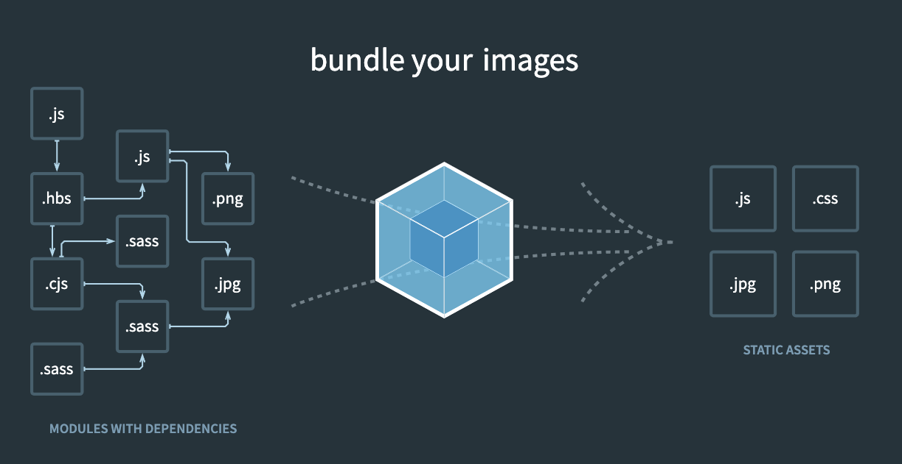

# Webpack

- **Module Bundler**

- 웹 애플리케이션을 구성하는 자원(HTML, CSS, Javascript, Images 등)을 모두 각각의 Module로 보고 이를 조합해서 병합된 하나의 결과물을 만드는 도구이다. 

## Module

- 프로그래밍 관점에서 특정 기능을 갖는 작은 코드 단위를 의미.
  
- 웹팩에서의 Module

  - JS에서만 국한되지 않고, 웹 애플리케이션을 구성하는 모든 자원을 의미.

  - **HTML, CSS, Javascript, Images, Font등 많은 파일 하나하나가 Module이다.**

  - 빌드 === 번들링 === 변환

  

## Module Bundling

- 웹 애플리케이션을 구성하는 수십, 수백개의 자원들을 하나의 파일로 병합 및 압축 해주는 동작을 모듈 번들링이라고 한다.

## 웹팩이 필요한 이유?

### 파일 단위의 JS 모듈 관리의 필요성

- 전역 변수, 함수 선언 시 발생할 수 있는 오류를 줄일 수 있다.

### 웹 개발 작업 자동화 도구

- 반복하는 작업, 수정 시 새로고침을 해야 하는 불편함을 해소할 수 있다.

- HTML, CSS, JS 압축

- 이미지 파일 용량 압축

- CSS 전처리기 변환

### 웹 애플리케이션의 빠른 로딩 속도와 높은 성능

- 웹 사이트의 5초 이내의 로딩 속도를 높여줄 수 있다.

- 브라우저에서 서버로 요청하는 파일 숫자를 줄인다. 

- 나중에 필요한 자원들은 나중에 요청하는 ㄹ이지 로딩 (Lazy Loading)

## 웹팩으로 해결하려는 문제

### 자바스크립트 변수 유효 범위 문제

- ES6의 Modules 문법과 웹팩의 모듈 번들링으로 해결한다.

### 브라우저별 HTTP 요청 숫자의 제약

- HTTP 요청 숫자를 줄이는 것이 웹 애플리케이션의 성능을 높여구조, 사용자가 사이트를 조작하는 시간을 앞당겨 준다.

### Dynamic Loading & Lazy Loading 미지원

- Code Splitting 기능을 이용해서 원하는 모듈을 원하는 타이밍에 로딩할 수 있다.

## Webpack build를 위한 구성 및 빌드 설정

### Mode

- webpack 3 / 4 버전의 차이로 development, production, none으로 설정할 수 있다.

- none: JS의 내용을 볼 수 있는 결과물로 출력된다.

- production: 

- development: 

### webpack.config.js

- 아래와 같이 일일히 entry output 을 지정하면 복잡한 파일 구조일수록 한 줄로 선언해주기 어렵다.

- 때문에, webpack.config.js 에서 정리하는 것이 작업상 더욱 효율적으로 작업할 수 있다!

~~~
  //package.json
  "scripts": {
    "build": "webpack --mode=none --entry=src/index.js --output=publid/output.js"
  },

  // webpack.config.js
  // `webpack` command will pick up this config setup by default
  var path = require('path');

  module.exports = {
    mode: 'none',
    entry: './src/index.js',
    output: {
      filename: 'main.js',
      path: path.resolve(__dirname, 'dist')
    }
  };
~~~

### IIFE(즉시 실행 함수 표현) - bundling.js 의 출력 형태 

- dist/bundle.js webpack으로 변환한 output 코드에는 

- 웹 서비스를 구성하나의 모듈, 각각의 파일들을 하나의 번호로 관리한다.

  - 첫째 줄을 줄여보면 0, 1, 3 ... 의 형태로 주석이 보여지는데, 변환하는 결과 파일 / 모듈에 따라서 나누어진 것.

  - main.js는 즉시실행 함수로 코딩되어 있다.

- 정의 되자마자 즉시 실행되는 JS Function을 말한다.

~~~
(funtion (){
  // code
})
~~~

## Webpack 장점

- 브라우저가 로딩되는 과정 

### Webpack은 따로 스크립트를 짜지 않아도 수월하게 웹 애플리케이션을 설정할 수 있고, 로딩 속도나 성능을 더욱 최적화 시킬 수 있다.

### 다양한 웹 자원을 각각의 모듈로 보고, 의존성 관계들을 묶어 병합된 하나이 JS 결과물을 자동으로 만들어 주는 도구를 의미한다.

- 반면, gulp, grunt, etc 등 웹 자동화 도구 들은 각 파일 형식 별로(js,css, assets) 스크립트를 작성해야 한다.

  - JS: Minify, Linters, Compile-to-js, Languages

  - CSS: SASS, LESS, UNICSS, POSTCSS

  - ASSETS: GifSicle, PngCrush, JpegTran, SVGO

