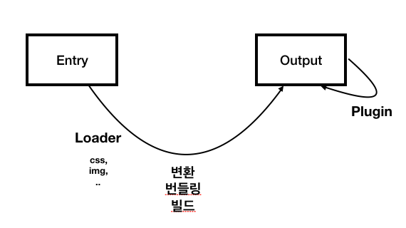

# webpack 주요 4가지 기능

1. Entry 속성은 웹팩을 실행할 대상 파일. 진입점

2. Output 속성은 웹팩의 결과물에 대한 정보를 입력하는 속성. 일반적으로 filename과 path를 정의

3. Loader 속성은 CSS, 이미지와 같은 비 자바스크립트 파일을 웹팩이 인식할 수 있게 추가하는 속성. 로더는 오른쪽에서 왼쪽 순으로 적용

4. Plugin 속성은 웹팩으로 변환한 파일에 추가적인 기능을 더하고 싶을 때 사용하는 속성. 웹팩 변환 과정 전반에 대한 제어권을 갖고 있음

## entry

- __**webpack에서 특정 웹 서비스에 대한 자원을 변환 / build / compile / bundling 을 하기 위한 최초 진입점이자, 자바스크립트 파일 경로**__

- 엔트리 포인트는 1개가 될 수도 있지만, 2개 이상이 될 수도 있다!

  - 엔트리 포인트를 분리하는 경우는 싱글 페이지 애플리케이션(SPA)보다는 특정 페이지로 진입했을 때 서버에서 해당 정보를 내려주는 형태의 멀티 페이지 애플리케이션에 적합하다.

  ~~~
  //webpack.config.js

  // entry point 1
  module.exports = {
    entry: './src/index.js';
  }

  // entry point 2 
  module.exports = {
    login: './src/LoginView.js',
    main: './src/MainView.js'
  }
  ~~~

## output

- webpack을 변환 / build / bundling / compile 하고 난 후, 결과물의 파일 경로를 의미한다.

~~~
//webpack.config.js
module.exports = {
  output: {
    filename: 'bundle.js'
  }
}
~~~

### output 속성 옵션 형태

-  최소한 filename은 지정해줘야 하며, 일반적으로 path 속성을 함께 사용한다.

  - path.resolve(): 인자로 넘어온 경로들을 조합하여 유호한 파일 경로를 만들어 주는 Node.js API 

~~~
//webpack.config.js
var path = require('path');

module.exports = {
  output: {
    filename: 'bundle.js',
    path: path.resolve(__dirname, './dist')
  }
}

<!-- 위와 같은 경로 -->
module.exports = {
  output{
    './dist/bundle.js'
  }
}
~~~

### output 파일 이름 옵션

- [name] [id] [hash] [chunkhash] + .bundle.js 와 같이 앞에 옵션을 붙여주면,

  - 빌드를 할 때마다 웹팩에서 고유 값을 붙여주게 된다. 
  
  - __** 즉, 브라우저 캐싱 때문에 같은 파일을 화면에 보여주는 경우 새로고침으로 캐시를 비워줘야 하는데, 위와 같은 옵션을 붙여줘서 고유값을 붙여줌으로써 사용자가 강제 새로고침을 하지 않아도 값을 제대로 확인할 수 있는 전략이다.**__

  1. 결과 파일 이름에 entry 속성을 포함하는 옵션

  ~~~
  module.exports = {
    output: {
      filename: [name].bundle.js
    }
  }
  ~~~

  2. 결과 파일 이름에 webpack 내부적으로 사용하는 모듈 ID를 포함하는 옵션

  ~~~
  module.exports = {
    output: {
      filename: [id].bundle.js
    }
  }
  ~~~

  3. 매 빌드시 마다 고유 hash 값을 붙이는 옵션

  ~~~
  module.exports = {
    output: {
      filename: [name].[hash].bundle.js
    }
  }
  ~~~

  4. webpack 각 모듈 내용을 기준으로 생성된 hash 값을 붙이는 옵션

  ~~~
  module.exports = {
    output: {
      filename: [chunkhash].bundle.js
    }
  }
  ~~~

## module(loader)

- [공식 문서](https://webpack.js.org/loaders/)

- __**웹팩이 변환 / build / bundling / compile 할 때 자바스크립트 파일이 아닌, 웹 자원 (HTML, CSS, Images, font 등)들을 자바스크립트로 변환할 수 있도록 도와주는 속성이다.**__

  ~~~
  module.exports = {
    module: {
      rules: []
    }
  }
  ~~~

### [예시] CSS Loader 적용하기

- npm 명령어로 css-loader를 설치하고, webpack 설정 파일 내용을 바꿔주면 CSS를 해석하기 위한 로더가 생성되면서, 에러가 없이 잘 변환 / bundling / build / compile이 된다.

- Terminal

  ~~~
  // Terminal
  npm i css-loader -save-dev
  ~~~

- module 쪽 코드를 보면, rules 배열에 객체 한 쌍을 추가했다. 그 객체에는 2개의 속성이 들어가 있는데,

  - **test: 로더를 적용할 파일 유형 (일반적으로, 정규 표현식 사용)**

  - **use: 해당 파일에 적용할 로더의 이름**

  ~~~
  // webpack.config.js
  module.exports = {
    entry: './app.js',
    output: {
      filename: './bundle.js'
    },
    module: {
      rules: [
        {
          test: /\.css$/,
          use: ['css-loader']
        },
        {
          
        }
      ]
    }
  }
  ~~~

### 자주 사용되는 loader

- Babel Loader

- Sass Loader

- File Loader

- Vue Loader

- TS Loader

  - 여러 개 사용하는 경우 rules 배열에 로더 옵션을 추가하면 된다.

  ~~~
  module.exports = {
    module: {
      rules: [
        {
          test: /\.css$/, 
          use: 'css-loader'
        },
        {
          test: /\.ts$/,
          use: 'ts-loader'
        }

      ]
    }
  }
  ~~~

### loader 적용 순서

- 특정 파일 유형에 대해, 여러 개의 로더를 사용하는 경우 로더가 적용되는 순서에 주의해야 한다.

- 기본적으로 **오른쪽에서 왼쪽 순으로 적용된다.**

- 예시

  - scss파일에 대해 먼저 sass-loader로 전처리를 한 다음, webpqck에서 CSS파일을 인식할 수 있도록 css-loader를 적용하는 코드이다.

  - style-loader를 사용해서 웹 애플리케ㅣ션에 inline 스타일 태그로 추가되는 것을 사용할 수도 있다.

~~~
// 옵션 미포함
module.exports = {
  module: {
    rules: [
      {
        test: /\.scss$/,
        use: ['style-loader','css-loader', 'sass-loader']
      }
    ]
  }
}

// 옵션 포함 시 배열 내 객체 형태로 작성 가능
module.exports = {
  module: {
    rules: [
      {
        test: /\.scss$/,
        use: [
          { loader: 'style-loader' } ,
          {
            loader: 'css-loader',
            options: { modules: true }
          },
          { loader: 'sass-loader' }
        ]
      }
    ]
  }
}
~~~

### loader 실행 시키지 않으면 ? 

- base.css 파일을 웹팩으로 돌리는 과정에서 css 파일 형식이 js 파일 안으로 들어가지지 않기 때문에 error가 난다.

~~~
ERROR in ./base.css 1:2
Module parse failed: Unexpected token (1:2)
You may need an appropriate loader to handle this file type, currently no loaders are configured to process this file. See https://webpack.js.org/concepts#loaders
> p {
|   color : blue;
| }
@ ./index.js 1:0-19
~~~

- css-loader: 자바스크립트가 CSS 파일 형식을 이해하도록 변환된다.

- style-loader: 웹팩 안으로 들어간 자바스크립트 CSS를 html 인라인 형태로 style 태그로 스타일을 넣어준다.

## plugin

- [공식 문서](https://webpack.js.org/plugins/)

- webpack의 기본적인 동작에 추가적인 기능을 제공하는 속성이다.

- __Loader는 파일을 해석하고 변환하는 과정에서 사용하는 반면에, Plugin은 Loader를 통해 만들어진 결과물의 형태를 바꾸는 역할을 한다.__

  ~~~
  module.exports = {
    plugins: [

    ]
  }
  ~~~

- 생성자 함수로 생성한 객체 인스턴스만 추가될 수 있다.

  ~~~
  module.exports = {
    plugins: [
      new HtmlWebpackPlugin(),
      new webpack.ProgressPlugin()
    ]
  }
  ~~~

### 자주 사용하는 플러그인

- split-chunks-plugin

- clean-webpack-plugin

- image-webpack-plugin

- webpack-bundle-analyzer-plugin

## 웹팩 결과 Log 분석 / bundle.js 분석

### terminal log 분석

~~~
<!-- webpack.config.js -->
ohminyoung-iMac:code-splitting ohminyoung$ npm run build

> code-splitting@1.0.0 build /Users/ohminyoung/Documents/personal/webpack_guide/code-splitting
> webpack // *** webpack이 실행되었다!

Hash: a44546c423fc6d0ed66a
Version: webpack 4.44.1 // *** 웹팩 버전
Time: 191ms // *** 웹팩 번들링 하는데 걸린 시간 
Built at: 2020-09-07 11:39:25
    Asset      Size  Chunks             Chunk Names
bundle.js  14.4 KiB       0  [emitted]  main
Entrypoint main = bundle.js
 // *** 모듈의 해석 순서!
[0] ./index.js 19 bytes {0} [built]  // *** 1. index.js entry point 부터 시작
[1] ./base.css 516 bytes {0} [built] // *** 2. CSS 코드 
[3] ./node_modules/css-loader/dist/cjs.js!./base.css 301 bytes {0} [built] // *** css-loader 시작
    + 2 hidden modules
~~~

### bundle.js 분석

- 번들링 되는 케이스 /* 0 */ 과 같은 형식으로 코드가 들어간다.

- Loader: 자바스크립트가 아닌 파일 형식을 자바스크립트의 형태로 변환해 주는 도구!

  - 밑에 CSS 예를 보면, import 시켯던 base.css가 자바스크립트의 형태로 코딩이 되어있음을 확인할 수 있다.

  ~~~
  /*****/
  /* 0 */
  /* 1 */
  ...
  /* 3 */
  /***/ (function(module, __webpack_exports__, __webpack_require__) {

  "use strict";
  __webpack_require__.r(__webpack_exports__);
  /* harmony import */ var _node_modules_css_loader_dist_runtime_api_js__WEBPACK_IMPORTED_MODULE_0__ = __webpack_require__(4);
  /* harmony import */ var _node_modules_css_loader_dist_runtime_api_js__WEBPACK_IMPORTED_MODULE_0___default = /*#__PURE__*/__webpack_require__.n(_node_modules_css_loader_dist_runtime_api_js__WEBPACK_IMPORTED_MODULE_0__);
  // Imports

  var ___CSS_LOADER_EXPORT___ = _node_modules_css_loader_dist_runtime_api_js__WEBPACK_IMPORTED_MODULE_0___default()(false);
  // Module
  ___CSS_LOADER_EXPORT___.push([module.i, "p {\n  color : blue;\n}", ""]);
  // Exports
  /* harmony default export */ __webpack_exports__["default"] = (___CSS_LOADER_EXPORT___);

  /***/ }),
  ~~~